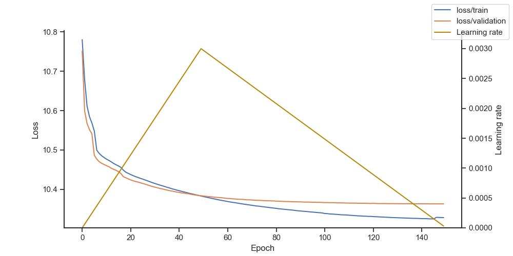
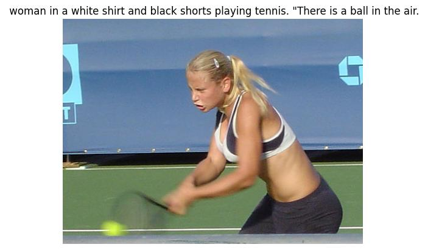
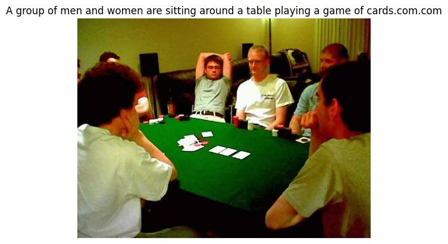
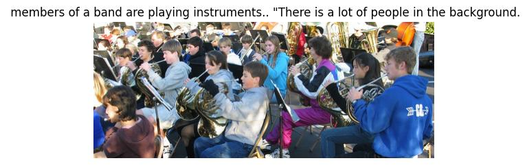

# CLIPxGPT Captioner

### Description

**`CLIPxGPT Captioner`** is Image Captioning Model based on [OpenAI's](https://openai.com/) [CLIP](https://openai.com/blog/clip/) and [GPT-2](https://openai.com/blog/better-language-models/). The Model uses a Mapping module to "translate" CLIP embeddings ​​to GPT-2. The model is trained on the [Flickr30k](https://shannon.cs.illinois.edu/DenotationGraph/) dataset, downloaded from [Kaggle](https://www.kaggle.com/datasets/hsankesara/flickr-image-dataset)

**The goal** of the project was to find out about the possibility of CLIP + GPT-2 connection and to check whether, with a relatively short training time and a small dataset, the model will be able to recognize situations in the pictures. In the first version, the model achieved satisfactory results.

The Model uses prefixes as in the [ClipCap](https://arxiv.org/abs/2111.09734) paper. In my original idea, the length of the prefix was 1, but after reading publication, the length of the prefix was changed to 4, thanks to which the performance increased.

The Model was trained with a frozen CLIP, a fully trained Mapping Module (6x Transformer Encoder Layers) and with partially frozen GPT-2 (the first and last 14 layers were trained).

The training process was carried out using the [Kaggle](https://www.kaggle.com/) P100 GPU. Training time - about 3 x 11h (150 epochs) with a linear learning rate warmup (max LR `3e-3`) and batch size 64. 

#### Loss and Learning Rate during training



### Example results





### Usage

Clone repository using:

```bash
git clone https://github.com/jmisilo/clip-gpt-captioning

cd clip-gpt-captioning
```

Create environment and install requirements:

```bash
python -m venv venv
# for windows
.\venv\Scripts\activate
# for linux/mac
source venv/bin/activate

pip install -r requirements.txt
```

And run prediction:

```bash
python .\src\predict.py -I <image_path>
```

### References:

- [OpenAI](https://openai.com/)
- [CLIP](https://openai.com/blog/clip/)
- [GPT-2](https://openai.com/blog/better-language-Models/)
- [ClipCap; Mokady, Ron and Hertz, Amir and Bermano, Amit H](https://arxiv.org/abs/2111.09734)
- [HuggingFace](https://huggingface.co/)